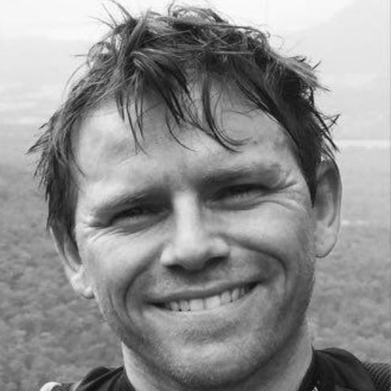

---
title: "About"
---

## Why, Hello There!

::: {.grid}

::: {.g-col-8}
I'm Darragh Murray, a data analytics and insights professional based in Brisbane, Australia, and the voice behind **Datavist.ai**. With over twenty years in the data field, I share ideas, thoughts, and learnings about the profession while helping organisations navigate their own data challenges.
:::

::: {.g-col-4}
{fig-alt="Darragh Murray" width="50%"}
:::

:::

## What I Do
My work spans the full spectrum of data – from engineering robust data & analytics pipelines and creating compelling visualisations to developing analytics strategies and exploring practical AI applications. I'm particularly passionate about data storytelling and turning complex information into clear, actionable insights.

Currently, I work in the Australian energy sector, but my experience crosses industries including international education, commercial property, public service, and even a stint in music journalism and the United Nations! This diverse background gives me a unique perspective on how data challenges vary across different contexts.

## Datavist.ai
This site is where I explore topics I find interesting – data visualisation techniques, analytics engineering approaches, business intelligence trends, and AI developments. 

You'll find a mix of professional insights, case studies, and the occasional deep dive into whatever dataset has caught my attention lately.

You'll also occasionally find reposts of articles I've written for my substack: [thedatavist.substack.com](https://thedatavist.substack.com), usually posted a bit after they appear there. 

## Experience & Credentials
I regularly present at conferences and contribute to the broader data community, sharing insights across the full spectrum of modern analytics platforms. My toolkit includes Power BI and the Power Platform, Tableau, and strong coding capabilities in R, Python, and SQL for complex analytical challenges and data engineering work.

My formal qualifications include degrees in information systems, international relations, history, and business analytics, plus certifications across multiple platforms including Tableau Professional certification and Alteryx Designer Advanced. I've also been elected as a Tableau Ambassador by the global Tableau community on three occasions, recognising contributions to that particular community.

I've helped organisations across Australia tackle diverse data challenges – whether that's building executive dashboards in Power BI, developing forecasting models in R, engineering data pipelines with Python and SQL, or creating comprehensive analytics frameworks that span multiple tools and platforms.

## Let's Connect
I'm always interested in discussing data challenges, sharing experiences, or collaborating on interesting projects. If you're working on something compelling or need guidance on your data journey, feel free to get in touch.

Whether it's a quick coffee chat or a more substantial engagement, I'm happy to explore how we might work together.

You're more than welcome to [connect with me on LinkedIn](https://www.linkedin.com/in/darraghmurray/). 

Cheers,  
Darragh

---
*The Datavist is built with Quarto, powered by GitHub, and published via Netlify.*
