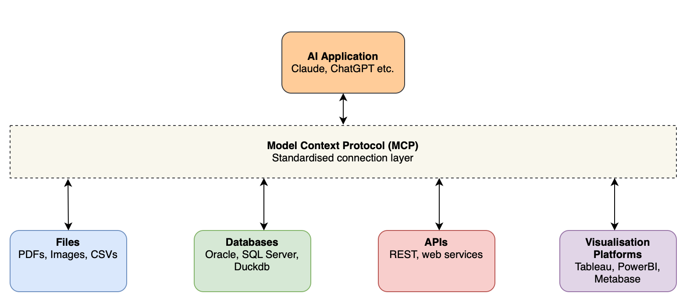
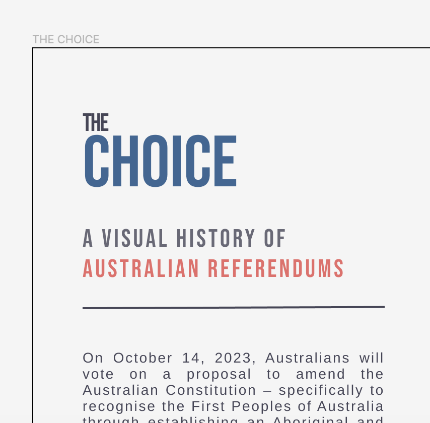

::: {.section}
[Selected work]{.section-label}

## Featured Projects

A selection of projects and case studies across data visualisation, analytics, and AI implementation.
:::

::: {.section}

::: {.portfolio-grid}

::: {.portfolio-item}
[{fig-alt="Tableau MCP" style="width: 100%; max-width: 400px; height: auto; aspect-ratio: 16/10; object-fit: cover;"}](posts/2025-06-25-early-experiments-tableau-mcp/index.qmd)

### [Tableau MCP Integration](posts/2025-06-25-early-experiments-tableau-mcp/index.qmd)
[AI / Tableau]{.meta}
:::

::: {.portfolio-item}
[{fig-alt="MCP Architecture" style="width: 100%; max-width: 400px; height: auto; aspect-ratio: 16/10; object-fit: cover;"}](posts/2025-07-14-mcp-reshaping-of-bi/index.qmd)

### [AI Reshaping Business Intelligence](posts/2025-07-14-mcp-reshaping-of-bi/index.qmd)
[AI / Strategy]{.meta}
:::

::: {.portfolio-item}
[{fig-alt="IronViz 2023" style="width: 100%; max-width: 400px; height: auto; aspect-ratio: 16/10; object-fit: cover;"}](posts/2023-11-04-reflections-on-ironviz-2023/index.qmd)

### [IronViz 2023: AFLW](posts/2023-11-04-reflections-on-ironviz-2023/index.qmd)
[Data Visualisation]{.meta}
:::

::: {.portfolio-item}
[{fig-alt="The Choice" style="width: 100%; max-width: 400px; height: auto; aspect-ratio: 16/10; object-fit: cover;"}](posts/2023-11-15-iterative-design-the-choice/index.qmd)

### [Iterative Design: The Choice](posts/2023-11-15-iterative-design-the-choice/index.qmd)
[Design Process]{.meta}
:::

:::

:::

::: {.section}
[Expertise]{.section-label}

## Skills & Experience

**Technical** — Tableau, Power BI, R, Python, SQL, dbt, Power Platform, LLM integrations, MCP

**Industries** — Energy & Utilities, International Education, Commercial Property, Government, Media
:::

::: {.cta}
## Interested in working together?

Let's discuss how these skills can help solve your data challenges.

[Get in Touch](contact.qmd){.btn .btn-primary}
:::
