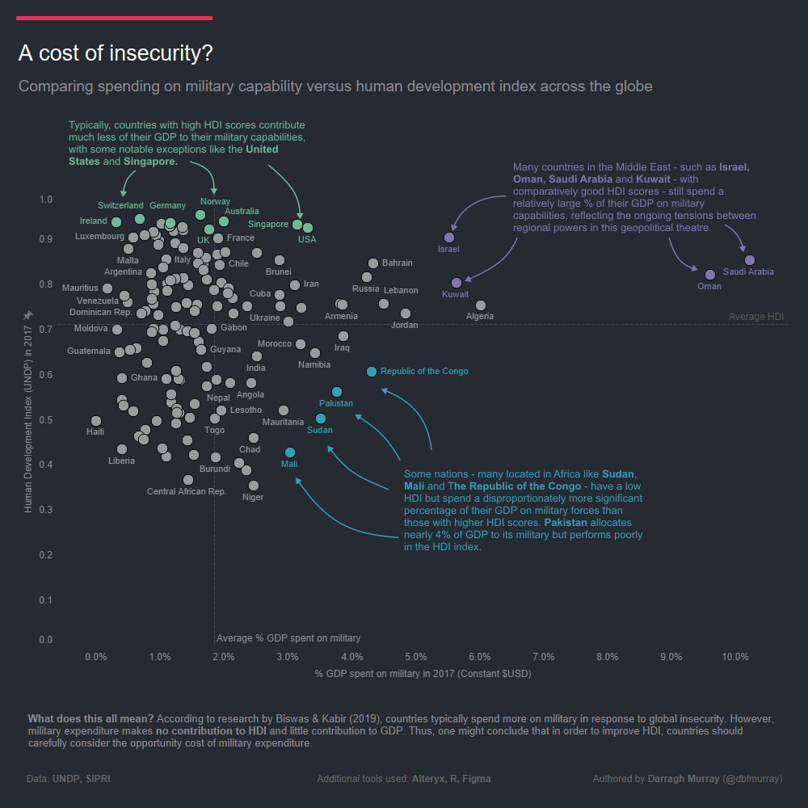

One great thing about the company I work for is that they continually encourage us to develop our skills via monthly data visualisation challenges. The latest challenge was themed on 'scatter plots' and it was definitely one I wished to be a part of – I love scatter plots!

Harking back to my postgraduate studies in international relations, I had sourced some data from the [Stockholm International Peace Research Institute](https://www.sipri.org/) around the percentage of GDP various countries use to support their military capability. I was very keen to do some analysis using this data but momentarily stuck with what to compare it with. But like a bolt from the blue, it hit me – why not look at this data in the context of the Human Development Index?

Voila – that was the catalyst for my newest bit of data visualisation work, and below is the result.

You can view the full interactive on [Tableau Public](https://public.tableau.com/app/profile/darragh.murray).

Thanks to Datawrapper for including the visual in its November 2 edition of the Data Vis Dispatch.

If you're thinking there are some strong John Burn-Murdoch vibes in this design, you're not wrong. I was directly inspired by some of his work. I was particularly keen on a simple one panel chart with some annotations.

I forwent Tableau's annotation capability in favour of hand drawing them in Figma – I really wanted curvy arrows! This was actually my first time designing something using Figma and I'm fairly pleased with the result.

Data preparation was done using a combination of Alteryx and R Stats – where I used the great CountryCode package to clean up country names in the two primary datasets I used. Extra design in the aforementioned Figma with Tableau doing the rest.

## Some quick insights on military spending v HDI

Some interesting insights are pretty apparent looking at these datasets. There is a host of nations who rate low on the HDI but who spend relatively big on military capability (typically in Africa, but Pakistan is also in the mix).

Many of these places are in the grips of conflict or have been in recent years – particularly in Sudan. Pakistan, of course, has geopolitical rivals such as India and China on its doorstep.

A group of nations in the Middle East also spend relatively big on military capabilities but have fairly good HDI – notably Israel. This phenomenon makes a lot of sense geopolitically.

Interestingly, most countries that lead the HDI ranks typically don't devote a large proportion of their GDP to military spending. These are countries usually located in Europe (Norway, Ireland, UK). US and Singapore may be exceptions – they have high HDI and above-average spending on the military.

Research indicates that military expenditure contributes nothing to HDI – and thus, improving HDI may require careful consideration of the opportunity cost of expanding military capabilities.
