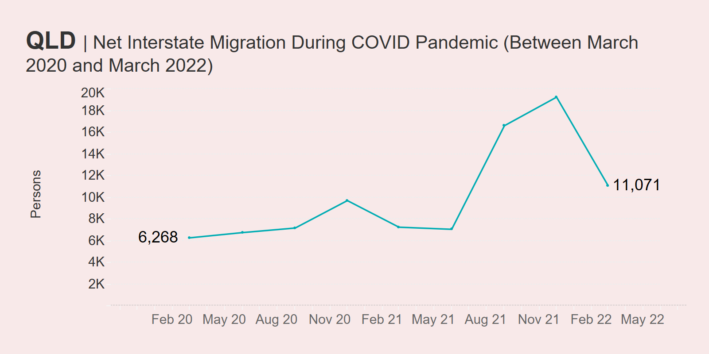
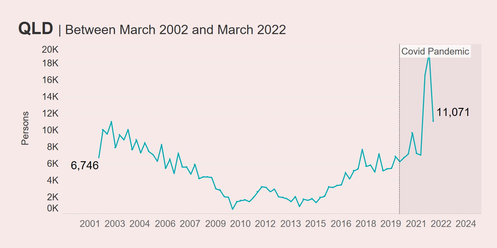
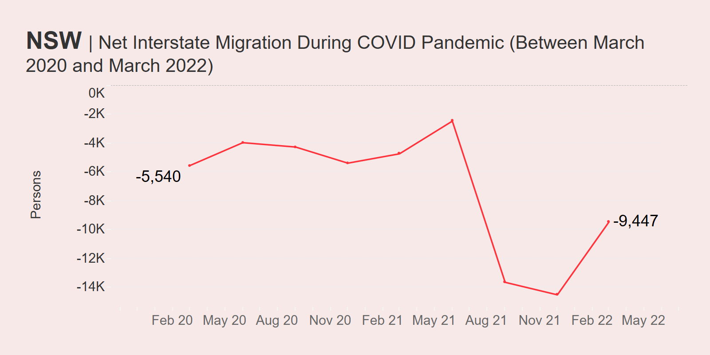
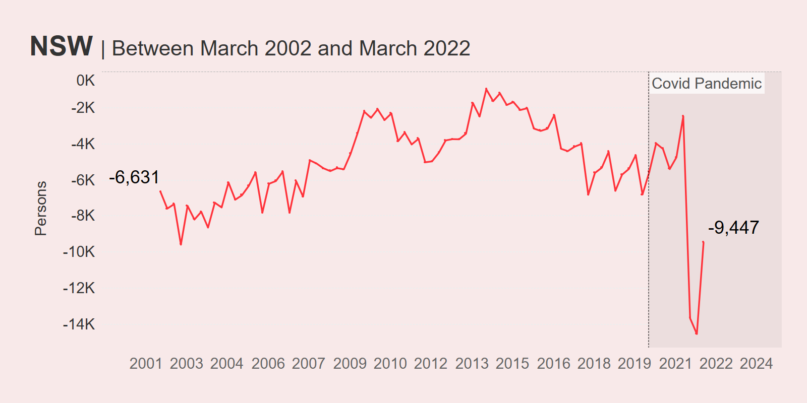
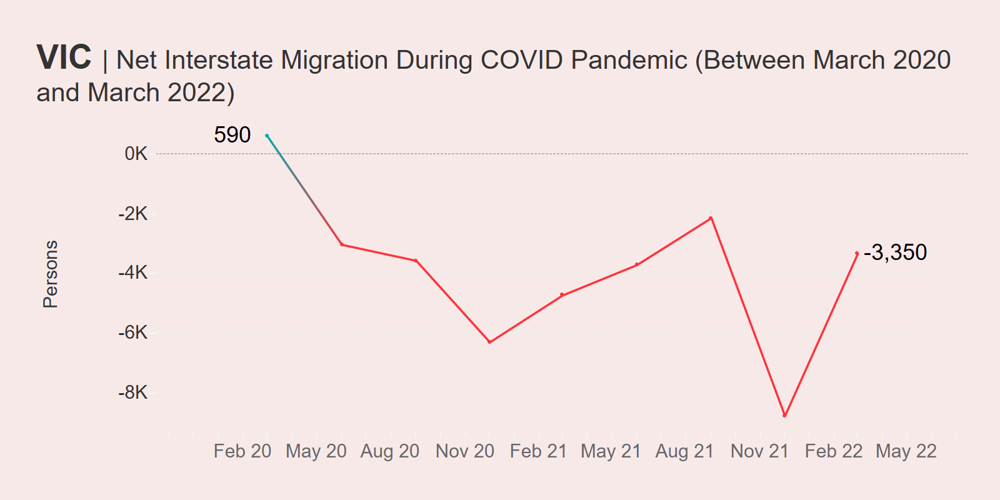
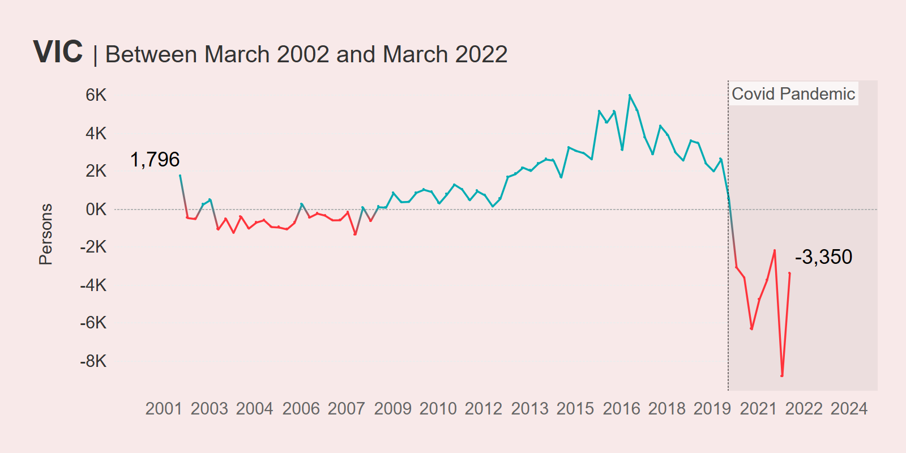
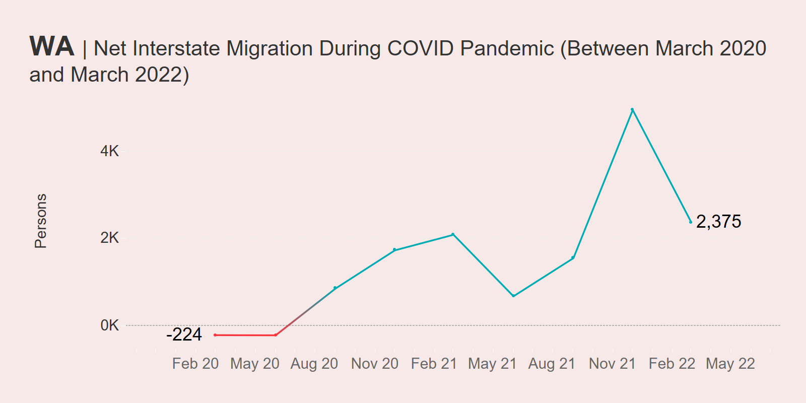
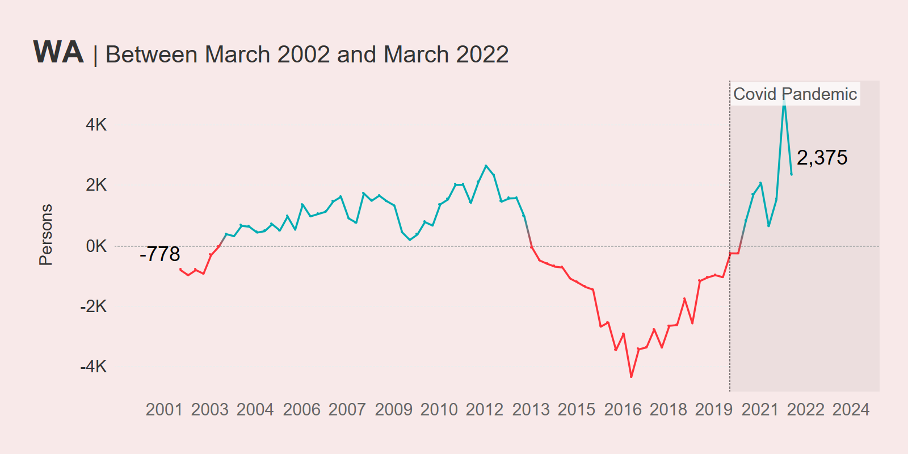

I recently published a dashboard to allow people to view Australian interstate migration figures using ABS data.

As I mentioned in the post introducing the dashboard, interstate migration became a hot topic throughout the first two years of the COVID-19 pandemic.

We witnessed en-masse movements of Australians throughout the country - some were seeking an escape from COVID and associated lockdowns, while others were seeking a change of scenery as they realised they could work their high-paying jobs in Australian metro locations such as Sydney and Melbourne from the comfort of other regions.

But a cursory look at the latest migration figures might reveal a change in outlook - and perhaps we see a shift back to the pre-COVID status quo as the threat of COVID lockdowns starts to fade from our memories.

Here are some quick charts and some even quicker analyses.

These charts measure net interstate migration (NIM) which is the difference between arrivals and departures from a particular location (source data is from the ABS Series 3101). The latest available data at the time of publishing was March 2022.

## Queensland was the population winner of the pandemic

Queensland has always done well at attracting migrants from other Australian States & Territories, but its performance during the early days of the pandemic saw it become increasingly popular as a destination, with a sharp increase in people calling Queensland home from around June 2021 onward.

Numbers peaked in December 2021 with a net interstate migration of just under 20,000. Since then, the growth in NIM has declined, but Queensland still had a positive result of around 11K as at March 2022.

Looking at longer-term trends, it's obvious that Queensland has always been popular, though the COVID-19 pandemic incentivised many to board planes to the Sunshine State.

## New South Wales got no favours from COVID-19

New South Wales is, in many ways, the complete opposite of Queensland. The pandemic basically accelerated the rate in which people left New South Wales for other Australian States & Territories, bottoming out in December 2021 at around -14K people (meaning way more left than arrived). However, things have marginally improved since then and as at March 2022, New South Wales' NIM trajectory is heading northward.

However, if net interstate migration was a State of Origin series, New South Wales has basically never won. Over the last twenty years, its NIM has always been negative - though the COVID period saw a complete bottoming out.

## The pandemic halted Victoria's great run

Victoria, and Melbourne in particular, bore the brunt of the COVID-19 lockdowns in the pre-vaccination days and so it's no surprise that far more people sought to leave the state than arrive. This is reflected in the COVID period migration data, which saw positive net interstate migration nosedive and bottom out in December 2021 at nearly -9,000 people.

Surprise, surprise - the pandemic represents the worst period for Victoria's NIM during the last twenty years. In fact, immediately prior to COVID-19, Victoria was on an upward trajectory, hitting +6000 in late December 2016.

One positive is, like New South Wales, Victoria has seen an uptick in its NIM since December 2021. It will be interesting to see if Victoria eventually heads back into positive territory over the coming months and years.

## Western Australia did oddly well all things considered

When I first posted this dashboard on Twitter, someone responded commenting about Western Australia's pretty good performance. In Australia, Western Australia was known for its quite strict border regime, which lingered on for some time.

Western Australia is hard to get to at the best of times, but they made it harder by keeping the gates closed for some time after the rest of the Australian States & Territories had reopened (The Guardian even called it the Hermit State).

With all that going down, you'd think that it would be difficult for WA to maintain a positive NIM, but the data shows that throughout COVID-19 that's exactly what they did. More people wanted to go to Western Australia than leave.

This trend has begun to reverse, with the NIM trajectory heading downwards as at March 22. However looking at the longer term 20-year trend, we can see that COVID-19 may have accelerated an already occurring trend - one where Western Australia had finally recovered from the hangover of the mining boom crash during most of the 2010s (which lasted from 2013 up until the start of the pandemic) and become a more desirable state to live in.

## Wrapping Up

While pretty surface level, the above analysis demonstrates some of the insights you can get out of the migration dashboard. Want to know how your State or Territory did? You can use the tool yourself on my [Tableau Public profile](https://public.tableau.com/app/profile/darragh.murray).

I'll be keeping it up to date as ABS migration data is released (usually every quarter with a six month lag).
