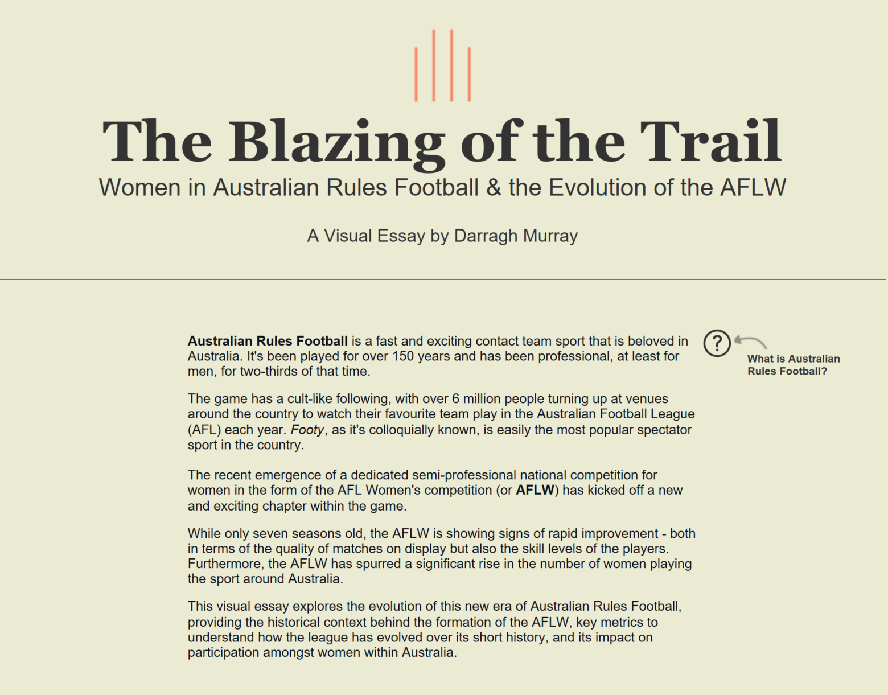

# My 2023 Iron Viz Journey: Lessons from the Data Visualisation Gauntlet

My first participation in Iron Viz Qualifier was a surreal experience.

As I hit the submit button with 10 minutes left until the submission deadline, I felt both wrung out and exhilarated. Like someone had squeezed champagne out of a tea towel. Bizarre metaphors aside, Iron Viz was an odyssey but still an overwhelmingly positive experience.

<figure style="display: block; margin: 25px auto; text-align: center;">
  
  <figcaption style="font-style: italic; margin-top: 10px;">AFLW Blazing of the Trail</figcaption>
</figure>

If you're unfamiliar with Iron Viz, it's an annual data visualisation competition built around the [Tableau Public](https://public.tableau.com/app/discover) platform. Participants worldwide have a month to create and submit work on a selected theme during qualifier rounds, hoping their submission is good enough to qualify them for the grand final held at the Tableau Conference each year. Three lucky data wizards face off for the title of Iron Viz champion in front of a live audience.

Even though I've used Tableau for years, I'd never been able to get something over the line in the Iron Viz qualifiers. Strangely, now with a newborn in tow, I managed to carve out some time over October to finish the work. This year the feeder theme was 'games', and participants could interpret this topic widely. Fortunately, the scope also included sports.

I immediately knew what I wanted to tell a story about: a deep dive into the history of women in Australian Rules Football and the evolution of the AFLW, the semi-professional, national league dedicated to women's Australian Rules Football. Not only was this topic something I'd been considering exploring for quite some time, I knew I could source high-quality, publicly accessible data quickly.

* [Here's is a link to the finished visualisation](https://public.tableau.com/app/profile/darragh.murray/viz/AFLWTheBlazingoftheTrail/AFLWBLAZINGTHETRAIL) - that ended up as one of the finalists!

# One Hectic Month

Despite having the topic and data sorted, my progress throughout October felt slow. I got bogged down in particular design aspects and frequently changed my mind about certain things. Coupled with a busy job, juggling the responsibilities of a 9-month-old and getting COVID-19 for the first time in the days before submissions - I was pretty stressed out by the end.

I almost gave in when I saw [Lindsay Betzendahl submit her stunning Wordle viz a week before the deadline](https://public.tableau.com/app/profile/lindsay.betzendahl/viz/AStoryofFiveLittleLetterzIronViz2023/LongForm). But after some encouraging words from colleagues and kind souls within the global Tableau #datafam and a not insignificant amount of caffeine and paracetamol (for the COVID-19), I pressed on - and managed to submit something that I was proud of with about 15 minutes to spare!

The result? An 8,500-pixel exploration of the [history of women in Australian Rules Football](https://en.wikipedia.org/wiki/Women%27s_Australian_rules_football), with a particular focus on the emergence of the semi-professional [AFLW competition](https://www.womens.afl/).

# Three Strategic Lessons from the Gauntlet

I wanted to share some lessons learned that apply to any demanding data visualisation project - whether it's Iron Viz or high-stakes client work.

## 1. Being decisive in topic selection and data gathering is a massive time-saving strategy

Data preparation is likely the most time-consuming task when building any data product. If you can minimise this aspect of the process, you'll maximise your time to work on the visible end product - the charts you construct and the narrative you weave.

A month seems like a long time, but given the inevitable roadblocks you'll encounter, your build will quickly consume available time. Being decisive in choosing a topic and data set will set you up early for success.

I was fortunate that I'd been thinking about my topic for quite some time before Tableau announced the qualifier topic. When the stars aligned on the specified theme, I immediately knew where to source the data and could get started on design and storytelling.

**Key takeaway:** Build a comprehensive list of exciting topics, datasets and relevant themes before you need them. Whether it's for Iron Viz or client projects, strategic preparation allows you to act decisively when opportunities arise.

## 2. Engage the community for critical feedback

The online data community is the most valuable asset you can tap into during any challenging project. Not only will it help you focus your ideas and approach, but it will also help you pick up errors, issues or ideas that you might have missed.

When you're deeply entrenched in data and the story you're trying to tell, being so close to a topic can be blinding. There's a reason academic work goes through long review processes before submission - fresh eyes and perspectives are invaluable.

I was very fortunate to have community superstars provide critical feedback along the journey. They gave up their time to review my work, and their commentary helped me focus my thoughts, critically reflect on design choices, and make tweaks that inevitably made my submission better. For example, advisors suggested subtle colour changes to aid accessibility, tweaks to language and terminology to make the story more inclusive, and chart choice optimisations.

**Key takeaway:** Build relationships with industry professionals who can provide constructive criticism. Whether it's the Tableau community for competitions or peer networks for client work, external validation strengthens your output and catches blind spots.

## 3. Accept that it will be demanding but ultimately rewarding

The Iron Viz feeder process is challenging. The skill level on display has increased exponentially in recent years, and you must bring your A-game if you want any chance of making it through.

But even if you don't make it through, or don't feel fully satisfied with what you produce, the process itself is valuable. Many times during this month-long visualisation marathon, I thought about quitting. It was demanding so much that I wasn't sure it was worth it.

But now, after I scrambled and got something in, I understand it was worth it. I learned more about using Tableau in one month than at any other stage - delving deep into new chart types, building complex radial gantt charts, and finally understanding the magic of map layers.

I also learned deeply about the subject matter. I now have excellent working knowledge of the history of women's participation in Australian rules, and ideas about how to analyse AFLW players and team statistics.

**Key takeaway:** Embrace challenging projects as growth opportunities. The skills and expertise gained from demanding work - whether competitions or complex client requirements - create competitive advantages and new capabilities.

# Why This Story Matters

Women in Australian Rules Football is admittedly a niche topic. The sport is only well-known in Australia, and women's participation has a relatively lower profile. But it's an important story to tell, considering how the women's league development seems to revolutionise women's sports in Australia.

AFLW is a sport I love watching, and this visualisation was my tribute to women's footy. Hopefully, my Iron Viz submission can increase its profile within Australia and globally.

# The Results

And what an end to the year it turned out to be! I found out that I placed in the **top 15** globally and **third** in the Asia-Pacific region in Tableau's annual Iron Viz competition for my interactive visual essay "*The Blazing of the Trail*".

Given the talent on enormous display in this globe's preeminent data visualisation competition, placing among the top entries is a huge privilege. I'm particularly thrilled because I *almost* didn't submit my entry as I was battling COVID-19 when the deadline loomed.

This result validates the strategic approach I've outlined above. Even a highly niche topic like women's Australian Rules Football can achieve recognition when you combine strategic preparation, community engagement, and commitment to demanding work.

**Key thanks:** My WDBI colleagues at JLL actively encourage team members to express creativity in competitions like this. [CJ Mayes](https://cj-mayes.com) was a sounding board for many ideas I put into my entry. Michelle Frayman and Kimly Scott from the Tableau community provided practical, constructive criticism that improved my visualisation. James Day's fabulous [Fitzroy API](https://jimmyday12.github.io/fitzRoy/) provided AFLW statistics in a convenient format.

I'd also like to thank Tableau and the competition judges for being brave enough to select a visual essay concerning such a niche topic as one of the top entries. 

Finally, my partner and little boy got less attention from me during October, and I want to thank them for their ongoing support.

* [Here's that link to the finished visualisation again](https://public.tableau.com/app/profile/darragh.murray/viz/AFLWTheBlazingoftheTrail/AFLWBLAZINGTHETRAIL).

**Well done** to the three finalists for IronViz 2023 - Brittany Rosenau, Paul Roos and Nirosh Perera. Your visualisations are amazing, and you all thoroughly deserve your place in the grand final in Las Vegas next year.

Feel free to drop me a line on LinkedIn if you want to chat Iron Viz or data visualisation strategy - until next time, have a great one!