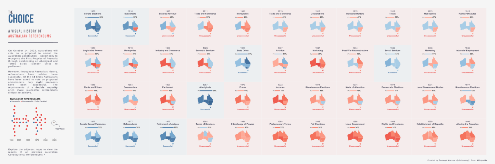
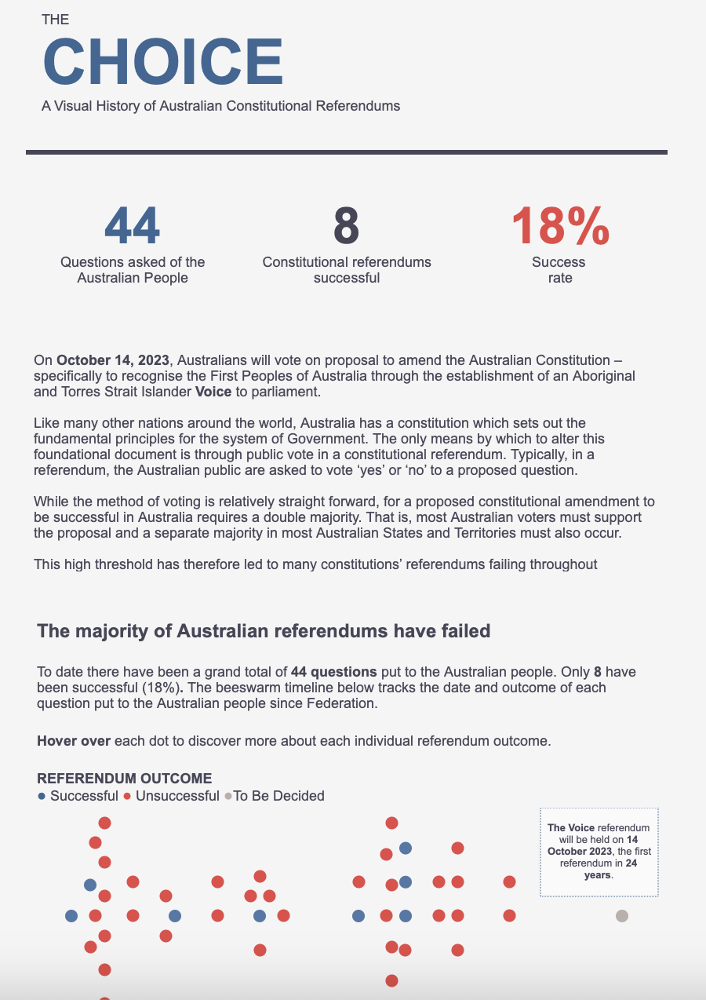
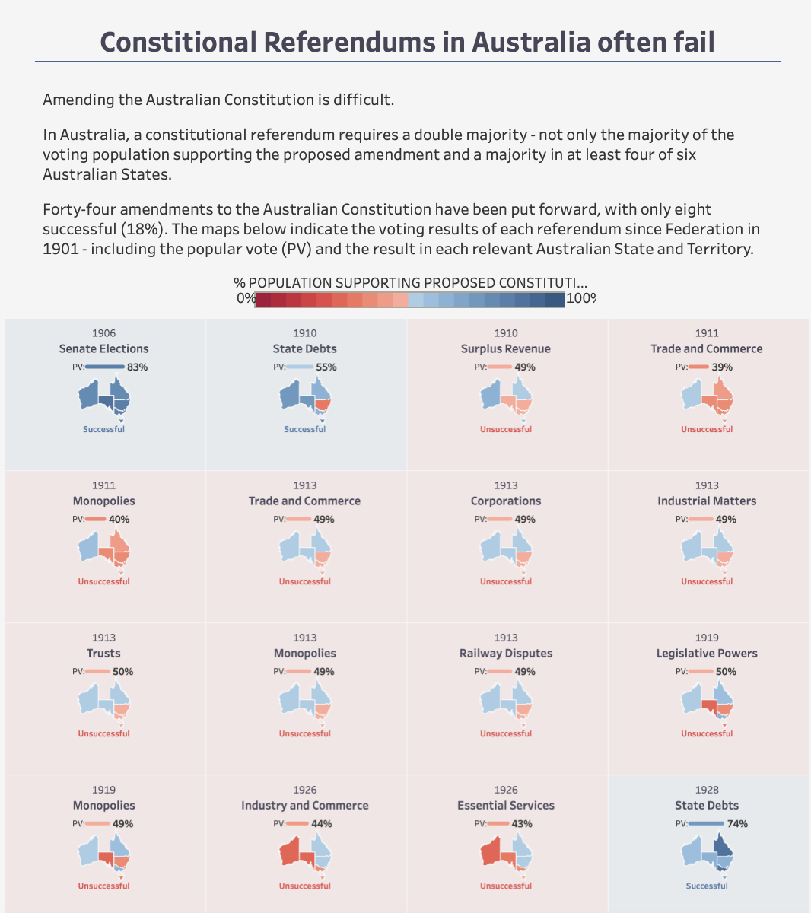

Early last month, I published a series of new [Tableau Public visualisations](https://public.tableau.com/app/profile/darragh.murray/vizzes) on the history of referendums in Australia, immediately prior to the latest Australian referendum vote on recognising Indigenous Australians in our constitution - commonly known as the referendum on **The Voice** to parliament (the vote failed but I'm not going to delve into the politics of that outcome here).

As I developed this series, I iterated through several design approaches before settling on a horizontally scrolling visualisation. This final version incorporates strategic design elements created in Figma (contextual text and custom fonts) with the core visualization developed in Tableau.

The small multiple maps with integrated bar charts were developed entirely in Tableau using map layers - a powerful yet underutilized feature that demonstrates the platform's advanced capabilities. Here's the final version:

<figure style="display: block; margin: 25px auto; text-align: center;">
  
  <figcaption style="font-style: italic; margin-top: 10px;">The final visual design I landed on</figcaption>
</figure>

During the development of this visualisation, I iterated through several versions before arriving at the final outcome. I thought I'd share the design process behind what became a project I'm genuinely proud of - the finished product incorporates strategic design elements created in Figma (contextual text and custom fonts) with the core visualisation developed in Tableau.

The small multiple maps with integrated bar charts were developed entirely in Tableau using map layers - a powerful yet underutilised feature that demonstrates the platform's advanced capabilities.

You can explore the [interactive version on Tableau Public](https://public.tableau.com/app/profile/darragh.murray/viz/TheChoice_16969413882860/TheChoice).

### Key insights from the data story

While I consider myself well-informed about Australian political history and understand that referendums require both a popular majority and majority support in at least four states, this visualisation revealed some surprising patterns.

Most striking was the **low success rate of constitutional amendments** - only **8 out of 44** proposed amendments have succeeded, representing just an **18% success rate**. This historical context provided important perspective on the challenges facing The Voice referendum.

The data also revealed that several referendums failed despite achieving popular majority support across Australia, occurring in **1946, 1977, and 1984**. Conversely, the [1967 referendum](https://aiatsis.gov.au/explore/1967-referendum) granting the federal government authority to make laws for Indigenous Australians achieved the highest success rate in Australian referendum history.

These insights reinforce my conviction that effective data visualisation serves as a powerful tool for rapid historical learning and contextual understanding.

### Design evolution: A three-version journey

Rather than simply presenting the final product, I've maintained all three versions as a case study in iterative design methodology. Each version addressed specific user needs and platform constraints while building toward the optimal solution.

- [The Choice - Version 1](https://public.tableau.com/app/profile/darragh.murray/viz/TheChoice/TheChoice)
- [The Choice - Version 2](https://public.tableau.com/app/profile/darragh.murray/viz/ReferendumsInAustraliaAlternativeVersion/ConstitutionalReferendums)

This approach preserves the design journey for educational purposes and demonstrates the value of systematic iteration.

### Version 1: Initial scrollytelling approach

The [first version](https://public.tableau.com/app/profile/darragh.murray/viz/TheChoice/TheChoice) employed my established 'scrollytelling' methodology - a vertically formatted visualisation featuring key performance indicators, a beeswarm timeline, and 44 small multiple maps created using Tableau's map layers. The dimensions (2000 x 5000 pixels) created a comprehensive but extensive user experience.

<figure style="display: block; margin: 25px auto; text-align: center;">
  
  <figcaption style="font-style: italic; margin-top: 10px;">Version 1: Comprehensive but challenging for social sharing</figcaption>
</figure>

While initially satisfied with this approach, I identified several optimisation opportunities. The extensive text content created barriers to accessing the core visual insights, and the large format proved challenging for social media distribution.

Additionally, I encountered technical formatting challenges when transitioning from Tableau Desktop to Tableau Public, particularly with text box positioning and Arial font rendering differences between platforms. This experience highlighted important considerations for cross-platform design consistency.

### Version 2: Social media optimisation

[Version 2](https://public.tableau.com/app/profile/darragh.murray/viz/ReferendumsInAustraliaAlternativeVersion/ConstitutionalReferendums) addressed the social sharing challenges by streamlining the design focus. I condensed the visualisation to emphasise the map elements whilst reducing supplementary text, enabling users to quickly grasp the key insights without extensive reading.

<figure style="display: block; margin: 25px auto; text-align: center;">
  
  <figcaption style="font-style: italic; margin-top: 10px;">Version 2: Optimized for social media consumption</figcaption>
</figure>

This strategic pivot proved successful, generating significant engagement when shared on [/r/australia](https://www.reddit.com/r/australia/comments/17454t1/constitutional_referendums_in_australia_often_fail/) and [/r/dataisbeautiful](https://www.reddit.com/r/dataisbeautiful/comments/1743726/comment/k485wi3/), reaching nearly **half a million views**.

However, valuable feedback from Tableau mapping expert [Dennis Kao](https://typefully.com/professorkao) identified an opportunity to better highlight successful referendum outcomes. This insight prompted the development of version 3, incorporating color-coded background tiles to distinguish successful amendments.

### Final version: Typography and visual hierarchy refinement

Building on the lessons from previous iterations, I developed the [final version](https://public.tableau.com/app/profile/darragh.murray/viz/TheChoice_16969413882860/TheChoice) to address typography limitations inherent in Tableau's design constraints.

While Tableau excels as a visualisation platform, its limited font flexibility can constrain design expression. To overcome this, I created custom background elements in Figma, enabling precise control over typography, including optimal line spacing for the title treatment.

<figure style="display: block; margin: 25px auto; text-align: center;">
  
  <figcaption style="font-style: italic; margin-top: 10px;">Final version: Enhanced typography through Figma integration</figcaption>
</figure>

This hybrid approach raises important accessibility considerations, as embedding text within images can create barriers for screen readers. It represents a common tension between design aesthetics and accessibility best practices in data visualization.

The final design also featured a restructured layout: a condensed beeswarm timeline and an 11x4 grid with horizontal scrolling functionality. User feedback indicated this approach improved the balance between contextual information and visual content consumption.

## Design methodology insights

This project exemplifies the iterative design process essential to effective data visualisation. Each version addressed specific user needs while building toward an optimal solution that balanced aesthetic appeal, technical constraints, and accessibility considerations.

The evolution demonstrates how successful visualisations often require multiple iterations to optimise for different contexts - from comprehensive analysis to social media engagement to refined user experience. Understanding these varied requirements enables designers to create more impactful and versatile data stories.

For organisations seeking to enhance their data storytelling capabilities, this case study illustrates the value of systematic design iteration, user feedback integration, and cross-platform optimisation strategies.