[I've previously written about the emergence of **Model Context Protocol** (MCP)](https://thedatavist.substack.com/p/mcp-and-the-reshaping-of-data-visualisation?r=8vq88), arguing for its potential game changing influence on the future practice of data visualisation and business intelligence.

So, I guess I wasn't suprised when leading visual analytics tool [Tableau released their first MCP server](https://github.com/tableau/tableau-mcp) earlier this week, providing data professionals like myself *"a suite of tools that make it easier for developers to build and configure AI applications that integrate with Tableau Cloud and Server."*

Given my experience with Tableau and newfound interest in MCP, I was keen to give this service a go. And I'm pleased to report early success.

I'm writing this article in a bit of a rush, covering the process I used to get it running in Anthropics's Claude Desktop and my initial experiments using the AI application to query data stored on Tableau Cloud. I'm keen to get it out in the world and see what others think - so apologies in advance for any errors (spelling, grammatical or otherwise), it's highly likely I'll revise this post in the future.

## What is Model Context Protocol?

I covered this in my [original Substack post](https://thedatavist.substack.com/p/mcp-and-the-reshaping-of-data-visualisation?r=8vq88), but to paraphrase: MCP is an open standard that simplifies how AI systems connect to external tools, apps, and data.

Instead of needing custom connectors for every service, MCP acts as a universal layer—one protocol that can pull from anything, whether it's a CSV, database, or business intelligence tool like Tableau.

Think of it as a plug-and-play system for giving AI the context it needs to provide more relevant answers.

## Leveraging Tableau's MCP Server

Tableau's plugin offers a clean, open way for AI tools like Claude to query Tableau dashboards and data using natural language—no complex API calls or coding required.

[Their MCP github repo](https://github.com/tableau/tableau-mcp) provides excellent instructions and outlines key implemented features. 

Currently, their toolset offers several data access tools for Tableau Server or Cloud instances:

- **list-datasources**: Retrieves a list of published data sources from a specified Tableau site (via REST API)
- **list-fields**: Fetches field metadata (name, description) for the specified datasource (Metadata API)
- **query-datasources**: Run a Tableau VizQL query (VDS API)
- **read-metadata**: Requests metadata for the specified data source (VDS API)

Yes, only four functions currently, but its pretty early days - and you can still do some interesting things with them. These functions are read-only, allowing you to retrieve data and metadata from Tableau servers, though they're limited to Tableau Published Data Sources.

I got started by cloning the Tableau repo into Visual Studio Code, installing Node.js using `npm install`, then building the plugin with `npm run build`. The [repo documentation](https://github.com/tableau/tableau-mcp) provides clear instructions.

## Setting Up Tableau Cloud 

Before configuring the MCP server within Claude, I needed to set up authentication and upload a dataset.

Authentication was straightforward via personal access token (PAT). I configured this in my user settings and noted the PAT token for later use in Claude's developer settings.

I sourced a FIFA 2021 complete player dataset from Kaggle for testing (though FIFA 2021 feels quite dated now!). I packaged this as a Tableau Published Data Source on Tableau Cloud, ready for Claude to query via the MCP server.

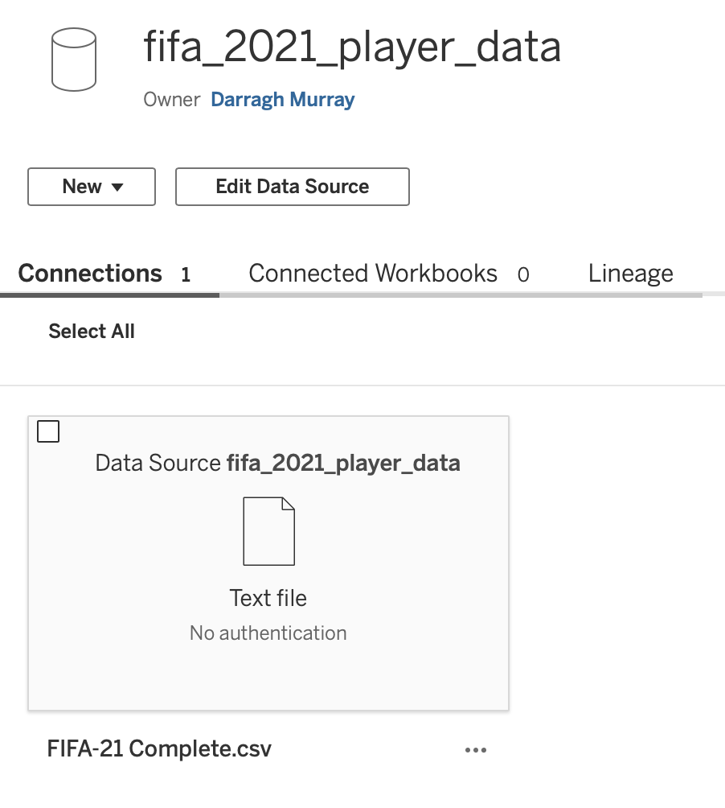

## Configuring Claude

This proved very straightforward—finding the required file directories on my computer took longer than the actual configuration.

In Claude's menu settings under Developer, you can edit the configuration file (mine was called `claude_desktop_config.json`). The required JSON block configures the local MCP server, specifying which script to run, environment variables, and server details. You essentially need your Tableau server location and PAT token for authentication.

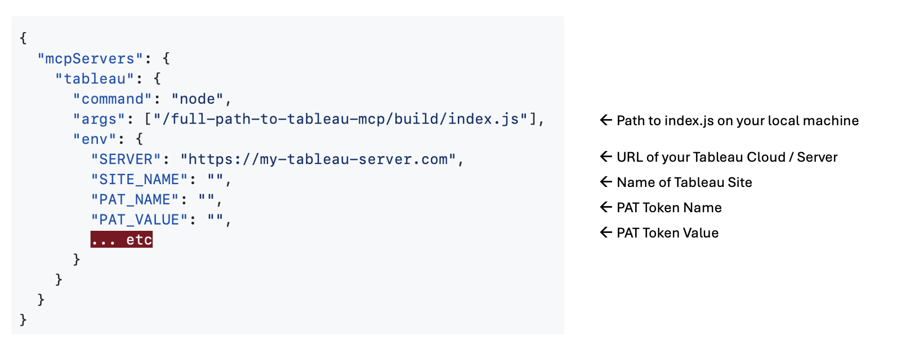

Save the configuration file and restart Claude. If successful, Claude loads without issue and flags 'tableau' as running in developer settings.

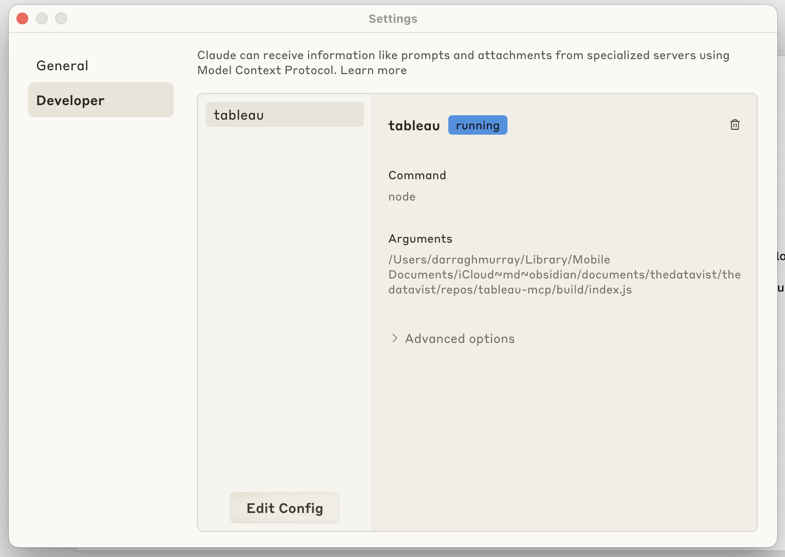

Furthermore, if the MCP server is running, you'll see it in the *search and tools* menu within the main Claude interface. 

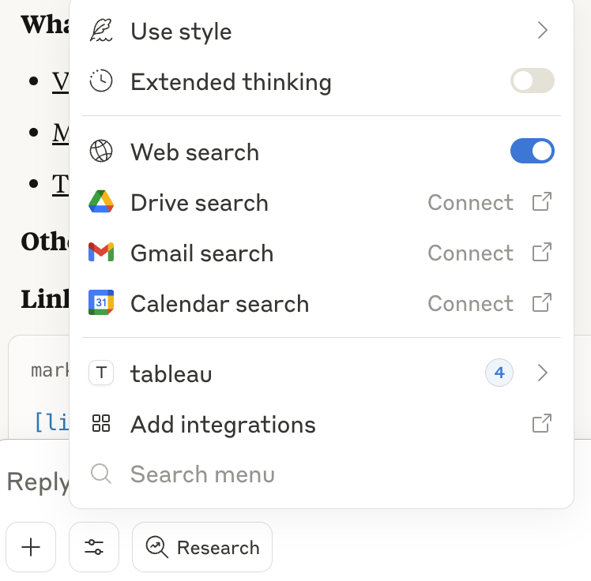

Claude will also give you the option to turn on and off certain tools within the server itself

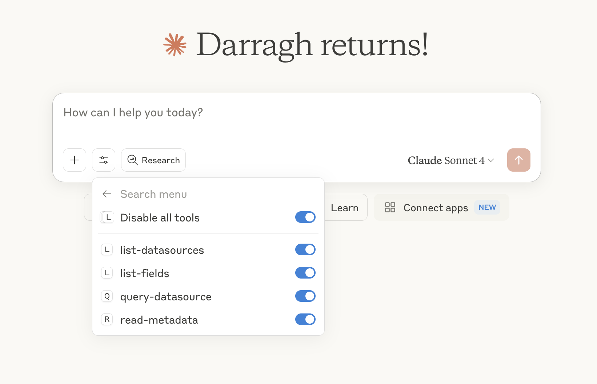

## Experimenting with the Server

Time for the fun stuff! I created a new chat and began testing.

First, I asked Claude to list all available data sources. Claude used `list-datasources` and returned 84 data sources. When I asked Claude to check for my FIFA 2021 datasource, it confirmed its presence.

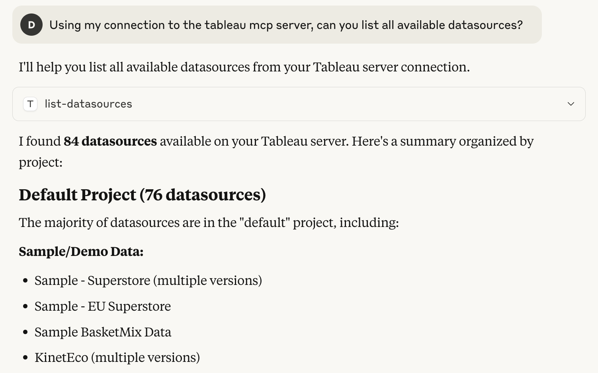

For more complex queries, I asked Claude to list columns in the FIFA 2021 dataset. It initially tried `list-fields` but failed, then smartly switched to `read-metadata`, uncovering nine columns and providing details about datatypes and categories.

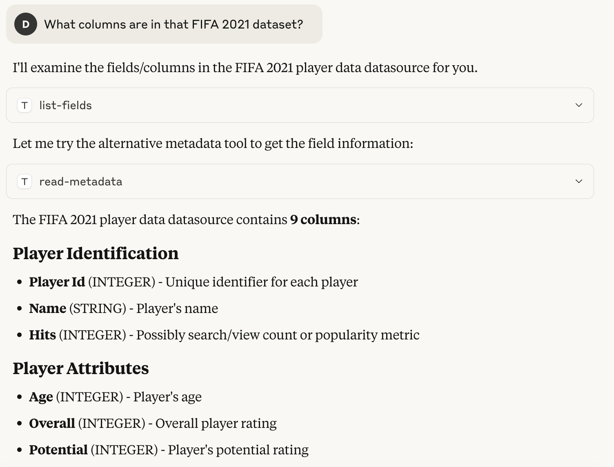

Getting analytical, I asked for the ten highest-rated players. Claude used `query-datasource` and quickly identified Lionel Messi and Cristiano Ronaldo at the top. When I asked about the fastest players, Claude correctly reported it couldn't find a relevant variable in the dataset.

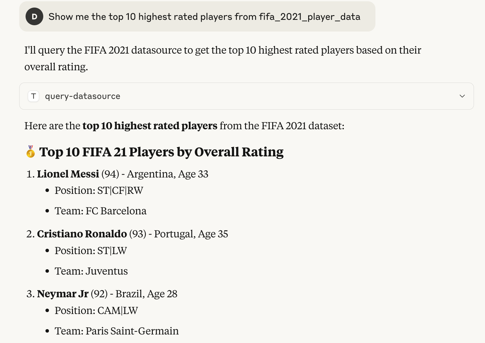

To note, Claude will ask you for permission when it tries to use an external integration, such as what you can see in the figure below.

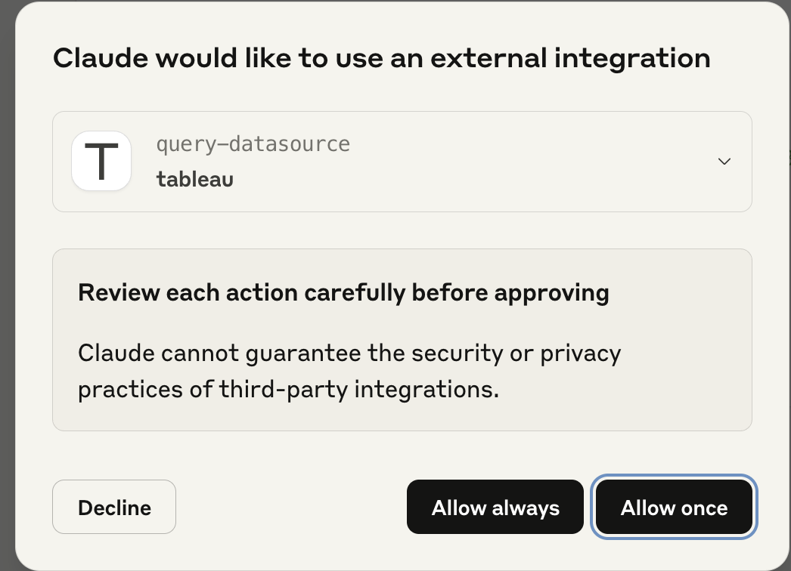

I also tested the server, by asking it questions it couldn't answer using the datasource I was connected to, such as 'who are the fastest players'. Claude used `list-fields`, and quickly concluded that it could not answer this question using the current context.

## Building Visualisations

I wanted to test some other capabilities, particularly whether I could use this Tableau Cloud data to build basic charts within Claude itself.

Unfortunately, due to the read-only functions available within the Tableau MCP implementation, I couldn't build charts within Tableau Cloud directly. However, I could leverage Claude's own ability to use tools like JavaScript and HTML to do some basic charting within the Claude application itself.

I first asked Claude to identify which countries had the most players in the top 100 rated players within the FIFA 2021 game. Claude used `query-datasource` and identified eight countries as 'top tier', with Spain having 13 players rated in the top 100.

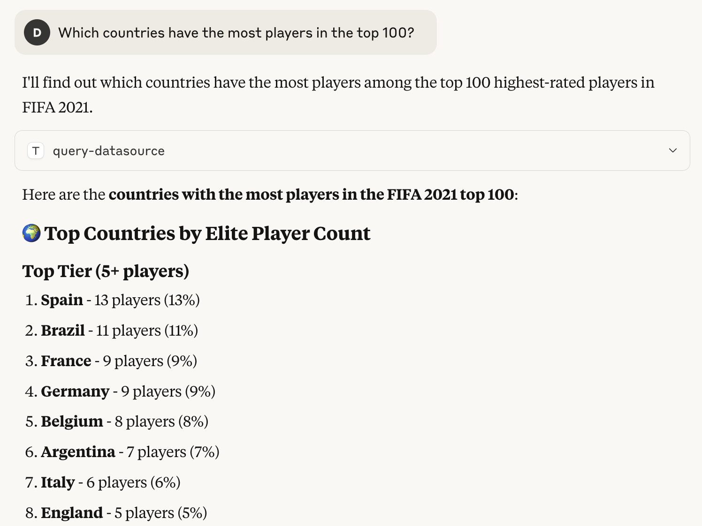

Great! I then asked Claude to chart this data. After a few stumbles with my prompting and some pointers from me on visual aesthetics, Claude retrieved the necessary data from Tableau via `query-datasource`, then generated an accurate—if unspectacular—column chart within Claude itself.

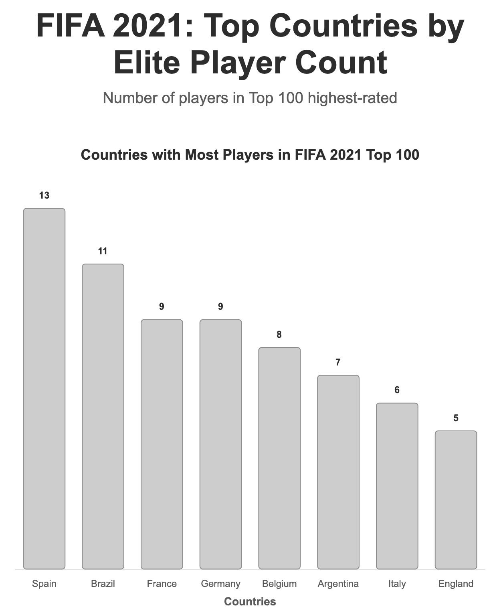

I decided to take it one step further, asking Claude to use Tableau data to build an entire dashboard. I prompted Claude with the following:

> "Can you create for me a dashboard showing the FIFA 2021 profile of Arsenal football club. Create four key KPIs across the top, and then two charts underneath, providing insight on where Arsenal is strong and weak versus other teams in the English Premier League within the FIFA 2021 game"

Claude again used `query-datasource` and responded with a slightly awful looking but functional dashboard! The output was a HTML file that used javascript to build the visuals.

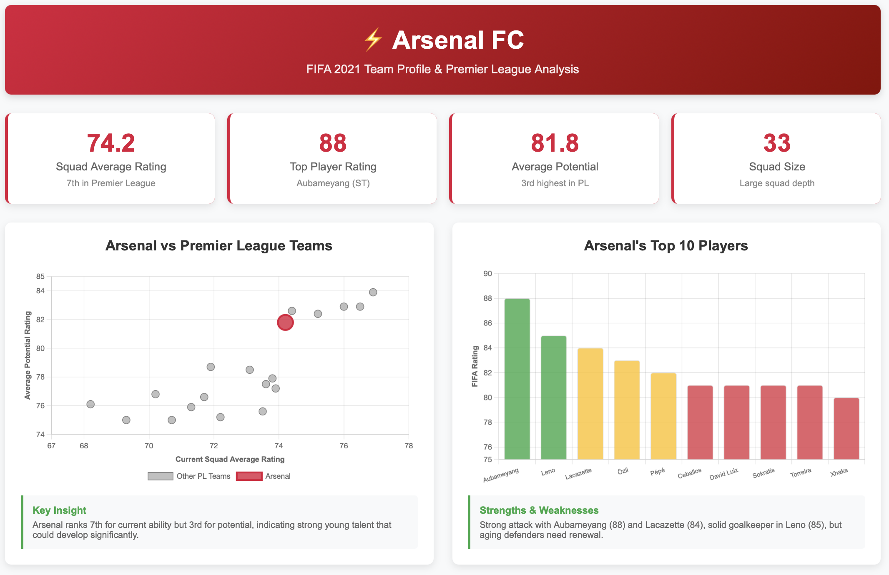

But I was still quite impressed at how quickly it was able to build this using a resource I'd created that sat on a Tableau Cloud server.

And that's where I called my experiment to an end.

## Quick Reflections

I've always been pragmatic about AI capabilities, preferring to observe their evolution. However, after exploring MCP and understanding its opportunities, I've become genuinely curious about its impact on analytics engineering, business intelligence, and data visualisation.

Even in early days, Tableau's MCP implementation provides interesting food for thought. The ease of querying Tableau Cloud data using natural language suggests the days of learning specific charting techniques in such tools might be numbered.

A year ago, I'd have dismissed such claims, but MCP's ability to facilitate seamless communication between AI applications and platforms, whilst providing necessary context for data understanding and insight generation, signals that shifts in the data professional landscape might arrive sooner than expected.

Tableau itself may pivot its development strategy from adding Desktop features to optimising its platform for AI applications to utilise its superior visual analysis capabilities.

It's a curious and exciting time to work in data—even with tools like Tableau. I'll continue experimenting with Tableau's MCP service to explore further possibilities.

Thanks for reading! If you're interested in my other writing and work, you can [check out my substack](https://thedatavist.substack.com) which is more focused on issues in the data profession, or [get in touch / connect via LinkedIn](https://www.linkedin.com/in/darraghmurray/).