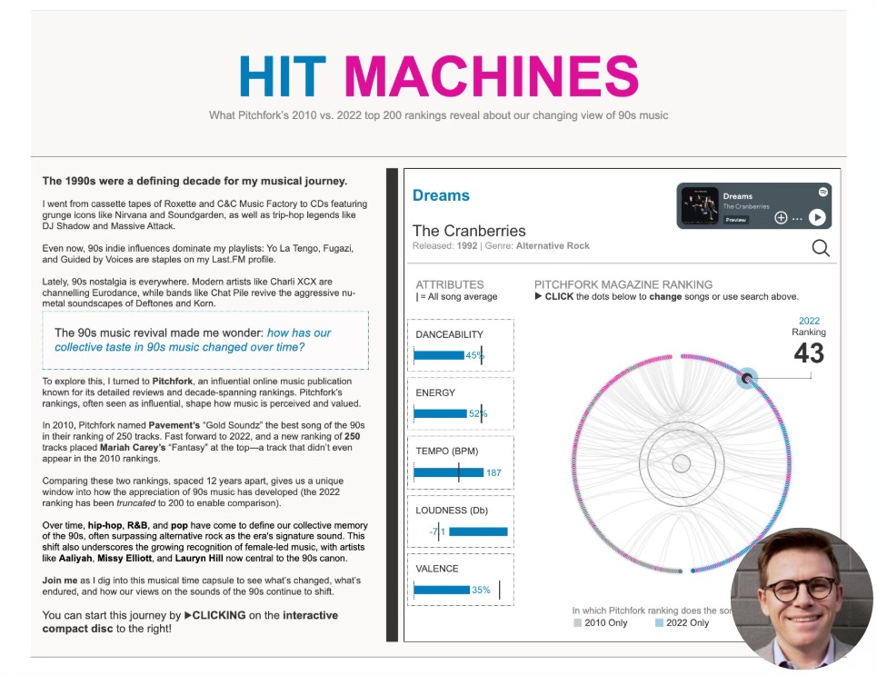

Tableau opened entries for the 2026 edition of Iron Viz earlier this week, which happens to be one of the biggest data visualisation competitions in the world. It's a competition I've been reasonably successful at, having finished in the final selection both times I've participated (2023 and 2025).

While I've never qualified in the top three and made it on stage at Tableau Conference, I'd like to think I've got some insight to share on how to do reasonably well at these events.

So, I've adapted some thoughts from a previous post I wrote a few years back, reflecting on my 2023 participation, in the hope it might assist anyone preparing their entry for the 2026 edition of Tableau's Iron Viz, or for any data visualisation competition really.

## It's Not Just About Talent

Data visualisation competitions like Iron Viz or the Information is Beautiful Awards can feel overwhelming. The talent on display is extraordinary, and with tight deadlines to complete your work, the pressure mounts quickly.

But here's what I learned after breaking through as a finalist in both Iron Viz 2023 and Iron Viz 2025: success in these competitions isn't necessarily about technical wizardry or design genius (though obviously these are also VERY important).

Hell, there are many submissions made by friends, acquaintances and colleagues who I think deserved a place ahead of me in the competition, but for whatever reason they didn't quite win the hearts and minds of the judges.

It's led me to believe that doing well isn't necessarily about having the greatest-looking chart of all time. Rather, it's about strategic preparation and smart execution.

This guide shares three core strategies that helped me place in the top 10 globally twice, even while juggling a full-time job, a newborn and a bout of COVID-19 in the final week.

## Strategy 1: Decisiveness Beats Perfection in Topic Selection

Here's the trap most people fall into: a month feels like plenty of time. You tell yourself you'll spend a few days exploring different angles, maybe try out a couple of datasets, see what feels right. Before you know it, two weeks have vanished into data preparation alone. Add in revisions, feedback cycles and technical challenges, and suddenly you're scrambling to finish anything at all.

The solution? Make quick, confident decisions about your topic and data sources from day one.

When Tableau announced "games" as the 2023 theme, I didn't spend days brainstorming. I immediately chose women's Australian Rules Football. Why? I'd been mulling over this topic for months. I knew exactly where to find high-quality, publicly accessible data. And crucially, I genuinely cared about the subject.

That decisiveness gave me something invaluable: time. While others were still hunting for the perfect dataset, I was already deep into design, storytelling and refinement.

I followed the exact same playbook in 2025 when I compared ranked lists of top songs across time. This wasn't a competition-day brainstorm. It was an idea I'd been sitting on for years.

The secret isn't having the perfect idea. It's having an idea ready to go.

### Start building your arsenal now

Don't wait until competition day to start thinking about topics. Keep a running list of subjects that fascinate you. Bookmark interesting datasets when you stumble across them. Make notes about which data sources are clean and accessible versus those that would require serious scraping or cleaning work.

When the competition launches, give yourself a hard deadline: 48 hours to commit to a topic. Choose something where you can source data within a week. Most importantly, pick something you're genuinely curious about. You'll need that intrinsic motivation when you hit the difficult middle phase.

### What to avoid

Topics that require pulling data from half a dozen different sources? That's weeks of work. Subjects you'd need to research deeply from scratch? You'll spend all your time learning rather than creating. Datasets riddled with quality issues? You're signing up for frustration.

And here's the most insidious trap: ideas that sound impressive but don't actually interest you. When the going gets tough (and it will), only genuine curiosity will keep you going.

## Strategy 2: Leverage Community Feedback Strategically

You've been staring at your visualisation for three weeks straight. Every colour choice, every label, every design decision is burned into your brain. And that's precisely the problem.

When you're this deep in your work, you develop complete tunnel vision. You'll miss accessibility issues that would be obvious to anyone else. You'll use phrasing that makes perfect sense to you but confuses fresh eyes.

The solution isn't just getting feedback. It's building a feedback network before you need it, then using it strategically throughout your build.

### Don't be that person who dumps and runs

The online data visualisation community is extraordinarily generous. Whether it's the Tableau #datafam, the Information is Beautiful community or Storytelling with Data circles, people genuinely want to help. But here's what doesn't work: dumping your work on someone with a vague "what do you think?" and expecting magic.

Instead, build genuine relationships throughout the year. Engage authentically with other creators' work. Offer your own feedback on their projects. Participate in community discussions, workshops and online events.

When you've built these relationships, people will actually want to help when you ask.

### Ask questions that people can actually answer

Don't ask: "Can you review my viz?"

Ask: "I'm torn between these two colour palettes, which better serves colourblind users?" or "Does this chart choice effectively communicate the trend I'm highlighting?"

You're not asking someone to magically diagnose everything. You're asking them to help you solve a specific problem you've already identified.

### Timing matters as much as the questions

In week one, validate your core concept and approach. In weeks two and three, get feedback on specific design decisions and story flow. In week four, focus on polish: accessibility issues, typos, final refinements. And critically, check whether your designs actually meet the competition requirements.

### The 10% that matters

In both my entries, community feedback didn't lead to dramatic overhauls. Instead, they caught the small things I'd become blind to. Subtle colour changes that improved accessibility. Terminology adjustments that made the story more inclusive. A confusing chart choice that seemed obvious to me but baffled everyone else.

These were 10% improvements. But that 10% transformed good work into finalist-quality work.

## Strategy 3: Embrace the Difficulty (The Reward is Real)

Let me be honest: competition work is absolutely grueling.

In 2023, I watched Lindsay Betzendahl submit her stunning Wordle visualisation a week before the deadline and nearly threw in the towel. What was the point? Her work was extraordinary. Mine felt ordinary by comparison.

The same year, I got COVID-19 in the final week. Feverish, exhausted, staring at my screen through a paracetamol haze, I kept asking myself: why am I doing this?

But here's what I've come to understand: the struggle is actually the point.

You'll learn more in one intense competition month than in six months of routine work. The pressure forces you to attempt techniques you've been putting off, to solve problems you'd normally sidestep, to push past your comfortable limits.

### The skills you'll actually gain

During my Iron Viz months, I learned chart types I'd never attempted. Complex radial Gantt charts that had always seemed too difficult. Advanced map layer techniques I'd bookmarked but never tried. Design patterns I'd only ever admired in other people's work.

These weren't theoretical skills. They immediately transferred to my work, making me more valuable professionally.

But the gains went beyond technical skills. I now have deep knowledge of women's Australian Rules Football history and the evolution of music charts over decades. This unexpected expertise has opened doors: speaking opportunities, consulting projects, connections with people working in those spaces.

And perhaps most importantly, completing difficult work under brutal deadlines builds real confidence. You'll know you can deliver under pressure because you've already proven it to yourself.

### How to actually survive the month

Set micro-deadlines throughout the month. Week one: topic selection, data gathering, initial sketches. Week two: first complete draft. Week three: refinement based on feedback. Week four: polish and submit, with buffer time built in.

Build in actual recovery time. Don't work every single evening. Burnout kills creativity. Schedule specific "off" days where you don't even open the file.

Celebrate the small wins along the way. Finished your data prep? That's genuinely worth acknowledging. Got positive feedback on a section? Let that fuel you through the next difficult stretch.

### Good enough is good enough

Perfection is impossible under time constraints. Define what "good enough to submit with pride" looks like, then stop when you hit it. Both times I submitted with about 15 minutes to spare. Not because my work was perfect, but because it met my threshold and I was out of time.

The goal isn't perfection. It's producing something you're proud of under somewhat brutal constraints.

## The Unsexy Truth About Competition Success

Here's what most competition guides won't tell you: placing well isn't primarily about being the most talented visualiser in the room.

Success is mostly about logistics. Starting with accessible data so you can actually focus on design. It's about social capital. Having a network of people who'll give you honest feedback when you need it. And it's about stamina. Pushing through the inevitable moment when you want to quit.

My 2023 Iron Viz visualisation covered an extremely niche topic. Women's Australian Rules Football is barely known outside Australia. But strategic preparation, community support and sheer bloody-minded persistence got it into the top 15 globally.

You don't need to be a design genius. You need to be strategic, well-connected and stubborn.

## One Last Thing

I almost didn't submit either of my Iron Viz entries. In 2023, COVID-19, exhaustion and self-doubt nearly won. In 2025, it was imposter syndrome and the temptation to just let the deadline pass.

But I'm glad I pushed through both times. Not just because I placed well, but because the process genuinely transformed my capabilities. The techniques I learned are now part of my everyday toolkit. The relationships I built have become genuine friendships and professional connections.

Your first competition might not result in finalist placement. That's completely fine. My first several attempts at Iron Viz went nowhere. Treat it as a learning experience, apply these strategic approaches and keep showing up.

The data visualisation competition scene genuinely needs more diverse voices and perspectives. Your unique background and viewpoint are valuable, even if your topic feels impossibly niche. That's often what makes work memorable.

So start building your preparation list now. Engage with the community authentically. And when the next competition opens, commit decisively and see it through.

While I'm choosing not to participate this year, I'm really looking forward to seeing what the global data visualisation community delivers.

If you're giving it a go, best of luck to you. The growth you'll experience is worth the temporary discomfort. I promise.
