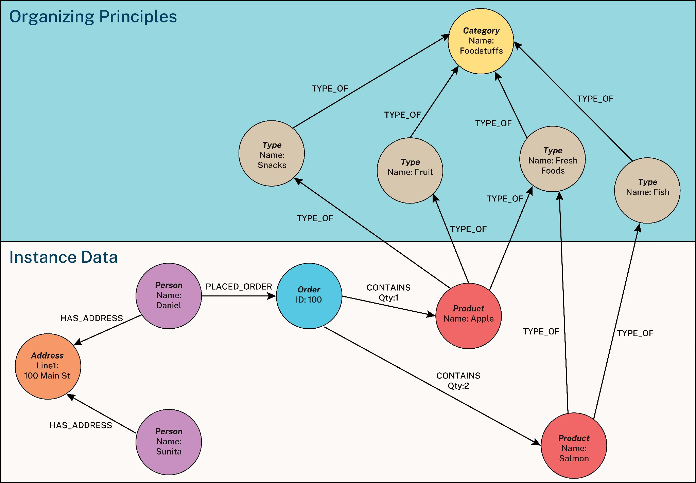

I started my career building information systems. The old-school kind where you spent half your time drawing entity-relationship diagrams and UML boxes before anyone touched a keyboard. Back then, "semantics" just meant:

*"Please don't name the customer table `CLIENT_MASTER_FINAL_2`".*

Then I wandered off into strategy, BI, and visual analytics for about a decade and barely wrote any SQL. When I returned to data and analytics engineering, I discovered a whole new vocabulary had sprung up.

Suddenly everything had become "modern", "cloud-native", and (now) "AI-enabled". And among the shiny new buzzwords was one I thought I recognised: **the semantic layer**.

At first, I assumed it was just the modelling work I used to do as a junior. And in a way I was right, but in many ways I was completely wrong.

## Defining the Semantic Layer

The term "semantic layer" is a buzzword, but it is one that deserves more attention than most. What does it mean?

In linguistics, semantics refers to the meaning behind words. In a data context, it is about understanding the meaning behind fields, metrics and labels.

Most people learn this meaning informally. You run queries until something looks right. You build a visualisation that reveals a pattern you did not expect. You ask a subject matter expert why a number suddenly looks odd. Over time, you learn that an "X" means soft delete, that a blank value is not the same as zero, or that a column called clientID refers to a company rather than a person.

The problem is that this knowledge usually sits in the heads of experienced analysts or in documentation that nobody reads. This is why senior staff can troubleshoot a data issue in minutes while newcomers often struggle for hours. They are not necessarily better analysts. They simply understand the hidden meanings in the data because they have all the necessary *semantic context*.

In a way a **semantic layer** replicates this knowledge by attempting to formalise this institutional knowledge. It sits between the raw data and the people who need to work with it, providing shared definitions that are easy to find and consistent across teams.

It might be a small glossary of business terms. It might be a set of standard taxonomies or entity definitions. It might be a fully-fledged knowledge graph that shows how data fits together.

At a simple level, it can be something like a YAML file that defines a **metric**:

```yaml
metrics:
  - name: monthly_recurring_revenue
    description: "MRR from paying customers, normalised to AUD"
    calculation: SUM(subscriptions.amount * exchange_rates.rate)

filters:
  - subscriptions.status = 'active'
  - subscriptions.plan_type != 'trial'
```

*Some random YAML that defines how a metric - monthly recurring revenue - is calculated.*

More complex versions appear as **entity relationship diagrams** or **knowledge graph** structures that describe how different concepts relate to one another.



*Source: John Stegeman (2024), "What is a Knowledge Graph", Neo4J*

Whatever form it takes, the purpose is the same: a semantic layer provides clear, reliable definitions of what the data means.

It captures not just metadata, such as the tables and columns and *objects* in a system, but business meaning, such as what counts as revenue or how an active user is defined, and why that stray "X" in a field matter.

## The Onboarding Process for Generative AI

Onboarding new employees can often be a time-consuming and stressful experience. When it's done well, it sets your new colleague up for success, and quickly. When it's done badly, the effects can reverberate through your team for months. The key is often being able to provide these employees with all the necessary information so they can do their job well as soon as possible.

Basically, this is the role the semantic layer plays when it comes to using generative AI within the enterprise.

> "The semantic layer functions as the crucial intermediary that translates human intent into structured queries while embedding business context that AI systems require for accurate interpretation." — Simon Späti (2025), Airbyte

While data semantics have existed for seemingly eons, they were often relegated to 'nice to haves' or 'boring documentation tasks that take the analyst away from the actual data work'.

Not anymore. **Generative AI eats semantics for breakfast.**

Without clear definitions of what data means, AI systems may struggle to generate accurate insights, answer questions reliably, or be trusted to make decisions.

For example, if an executive asks an AI agent "How much revenue did we generate last month?", the LLM might count refunds, include deleted transactions, use incorrect currency conversions, and confidently report a highly inaccurate answer that would be difficult to detect without thorough validation.

However, providing that agent with a semantic layer, a clear definition of what constitutes 'revenue' in your business, gives it a reliable shortcut, likely resulting in a far more accurate answer.

Contemporary research backups up the contention that semantic context isn't just nice-to-have; it's essential for accuracy.

Sequeda and Allemang (2025) demonstrated how pairing foundation AI models with well-defined semantics can dramatically improve LLM performance. They demonstrated that when LLMs can access business semantics through ontologies and knowledge graphs, accuracy jumps from 16% to 72% compared to querying raw databases directly. Without that semantic structure, AI tools hallucinate, making up plausible-sounding but incorrect answers because they're missing the business logic that tells them what 'revenue' actually includes or how 'active users' are defined in your specific context.

## Semantics as critical data and AI infrastructure

The semantic layer is not a revolutionary idea.

**It is the documentation and knowledge management work that good data teams have always done,** but now it has become far more important because AI systems rely on it.

Joe Reis (2025) puts it well in his upcoming book on data modelling:

> "With the rise of AI as both a consumer and generator of data, semantics is no longer a second-class citizen. Semantics ensures that the real-world meaning of data and the relationships among different data elements are consistently captured and understood by people and machines."

For years, the meaning behind data lived in people's heads, in Teams threads, or in pages of documentation that are haphazardly maintained. That possibly worked well enough when the main consumers of data were humans who could ask clarifying questions.

Currently, AI struggles here. It cannot tap you on the shoulder and ask whether revenue includes refunds. It needs that context written down, clear, and accessible in well crafted prompts with accompanying files. Without it, you get confident but potentially incorrect answers. With it, accuracy can move from guesswork to something far more dependable.

So yes, "semantic layer" is a buzzword. But it is also the foundation for any AI-enabled analytics future. If you work with data, you are already doing semantic work. The real question is whether you are capturing it in a way that a machine can actually use.

## Further reading

- Allemang, Dean, Byron Jacob & Juan F. Sequeda. "Increasing the LLM Accuracy for Question Answering: Ontologies to the Rescue!" 2024. <https://arxiv.org/abs/2405.11706>
- Allemang, Dean and Juan F. Sequeda. "Knowledge Graphs as a source of trust for LLM-powered enterprise question answering" 2025. <https://arxiv.org/abs/2405.11706>
- Jones, Alexis. "Semantic Layer: What it is and when to adopt it." dbt Labs, 2024. <https://www.getdbt.com/blog/semantic-layer-introduction>
- Reis, Joe "Semantics, Ontology and Taxonomy, and Metadata" Practical Data Modeling, 2024.
- Späti, Simon. "The Rise of the Semantic Layer: Metrics on the Fly." Airbyte, 2024. <https://airbyte.com/blog/the-rise-of-the-semantic-layer-metrics-on-the-fly>
- Stegeman, John. "What Is a Knowledge Graph?" Neo4j, 2024. <https://neo4j.com/blog/genai/what-is-knowledge-graph/>
